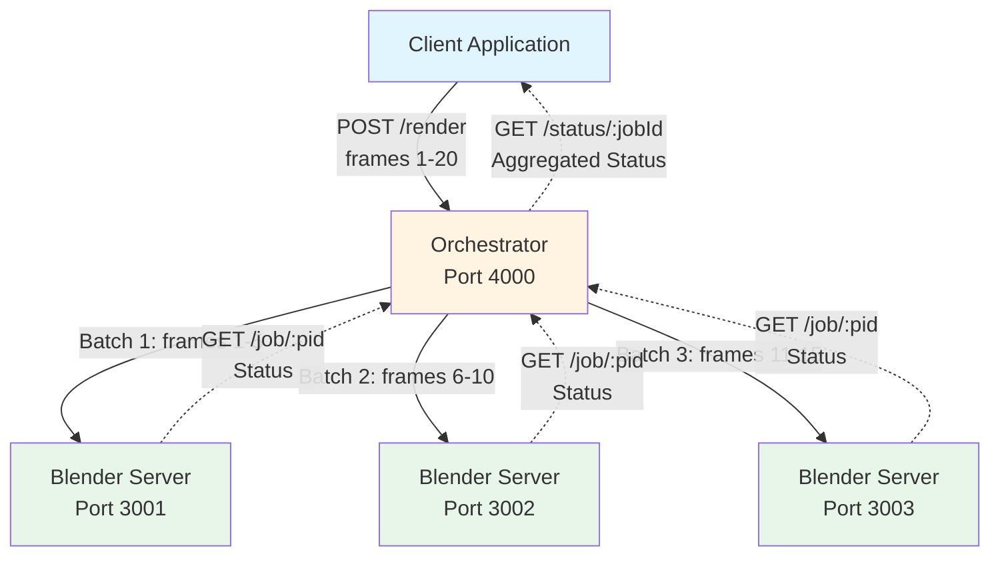

# Part 2: Creating an Orchestrator

In this section, we'll build an orchestrator to manage and distribute Blender rendering jobs across multiple nodes. This enables parallel processing and efficient resource utilization.

<div class="learning-objectives">
<strong>🎯 Learning Objectives</strong>
<ul>
<li>Understand the role of an orchestrator in distributed systems</li>
<li>Split workloads into batches for parallel processing</li>
<li>Use Promise.all() for concurrent HTTP requests</li>
<li>Aggregate status from multiple nodes</li>
<li>Implement work distribution algorithms</li>
<li>Handle errors in distributed operations</li>
</ul>
</div>

## Why Use an Orchestrator?

An orchestrator helps manage and distribute workloads across multiple nodes, providing several benefits:

- **Parallel Processing**: Split large tasks into smaller batches and process them simultaneously
- **Resource Utilization**: Efficiently use available computing resources across multiple machines
- **Scalability**: Add more nodes to handle increased workload
- **Fault Tolerance**: Detect and handle node failures
- **Progress Monitoring**: Track the status of distributed jobs

## Architecture



## Step 1: Creating the Orchestrator API

### 1. Initialize the Node.js Project

Set up a new Node.js project for the orchestrator:

```bash
mkdir orchestrator
cd orchestrator
npm init -y
npm install express axios
```

**Why axios?** We use axios to make HTTP requests to the rendering nodes.

### 2. Create the Orchestrator Server

Create a file named `orchestrator.js`:

```javascript
const express = require('express');
const axios = require('axios'); // For making HTTP requests to the nodes
const app = express();

app.use(express.json());

const port = 4000;
const NODES = [
    'http://localhost:3001',
    'http://localhost:3002',
    'http://localhost:3003',
]; // List of node endpoints
const BATCH_SIZE = 5; // Define batch size as a constant
let jobs = {}; // Store all jobs

// POST /render endpoint to start rendering a movie
app.post('/render', async (req, res) => {
    const { from, to } = req.body;
    if (from === undefined || to === undefined) {
        return res.status(400).send('Invalid input');
    }

    const jobId = generateJobId();
    jobs[jobId] = { status: 'pending', batches: [] };
    const frameChunks = splitFramesIntoChunks(from, to, BATCH_SIZE);
    const jobPromises = frameChunks.map((chunk, index) =>
        assignJobToNode(NODES[index % NODES.length], chunk.from, chunk.to, jobId)
    );

    try {
        const results = await Promise.all(jobPromises);
        jobs[jobId].batches.push(...results); // Save batch info
        res.status(202).header('Location', `/status/${jobId}`).send({ jobId });
    } catch (error) {
        console.error('Error assigning jobs:', error);
        jobs[jobId].status = 'failed';
        res.status(500).send('Failed to distribute jobs');
    }
});

// GET /status/:jobId endpoint to check overall job status
app.get('/status/:jobId', async (req, res) => {
    const jobId = req.params.jobId;
    const job = jobs[jobId];

    if (!job) {
        return res.status(404).send('Job not found');
    }

    try {
        const statusPromises = job.batches.map(batch =>
            checkJobStatus(batch.node, batch.pid)
        );
        const statuses = await Promise.all(statusPromises);
        const allCompleted = statuses.every(status => status === 'completed');

        if (allCompleted) {
            job.status = 'completed';
            res.status(200).send('Job completed');
        } else {
            job.status = 'in-progress';
            res.status(202)
                .header('Location', `/status/${jobId}`)
                .header('Retry-After', 5)
                .send('Job still running');
        }
    } catch (error) {
        console.error('Error checking job statuses:', error);
        res.status(500).send('Failed to fetch statuses');
    }
});

// Utility function to generate a unique job ID
function generateJobId() {
    return Math.random().toString(36).substring(2, 15);
}

// Utility function to split frames into chunks
function splitFramesIntoChunks(from, to, batchSize) {
    const chunks = [];
    for (let i = from; i <= to; i += batchSize) {
        chunks.push({ from: i, to: Math.min(i + batchSize - 1, to) });
    }
    return chunks;
}

// Utility function to assign a job to a node
async function assignJobToNode(nodeUrl, from, to, jobId) {
    console.log(`Invoking URL: ${nodeUrl}/job with frames ${from} to ${to}`);
    try {
        const response = await axios.post(`${nodeUrl}/job`, { from, to });
        console.log(`Job assigned to ${nodeUrl} with PID: ${response.data.pid}`);
        return { node: nodeUrl, pid: response.data.pid };
    } catch (error) {
        console.error(`Failed to assign job to ${nodeUrl}:`, error.message);
        throw error;
    }
}

// Utility function to check job status
async function checkJobStatus(nodeUrl, pid) {
    const response = await axios.get(`${nodeUrl}/job/${pid}`);
    return response.data.status === 'Job completed' ? 'completed' : 'running';
}

// Start the orchestrator server
app.listen(port, () => {
    console.log(`Orchestrator running on port ${port}`);
});
```

> **Note:** The node URLs in the `NODES` array should match the rendering nodes from Part 1. You can run multiple instances of the server on different ports or use different machines.

## Step 2: Running the Orchestrator Server

Navigate to the `orchestrator` directory and start the server:

```bash
node orchestrator.js
```

You should see:
```
Orchestrator running on port 4000
```

## Step 3: Using the Orchestrator API

### Submitting a Render Job

To submit a request to render frames 1 to 20:

```bash
curl -X POST http://localhost:4000/render \
  -H "Content-Type: application/json" \
  -d '{"from": 1, "to": 20}' \
  -i
```

**Response:**
```
HTTP/1.1 202 Accepted
Location: /status/abcd1234
Content-Type: application/json

{"jobId":"abcd1234"}
```

### Checking Job Status

Use the job ID from the previous response:

```bash
curl -X GET http://localhost:4000/status/abcd1234 -i
```

**While jobs are running:**
```
HTTP/1.1 202 Accepted
Location: /status/abcd1234
Retry-After: 5

Job still running
```

**When all jobs complete:**
```
HTTP/1.1 200 OK

Job completed
```

**If job ID doesn't exist:**
```
HTTP/1.1 404 Not Found

Job not found
```

## Understanding Promise.all()

The orchestrator uses `Promise.all()` to execute multiple asynchronous operations in parallel:

```javascript
const jobPromises = frameChunks.map((chunk, index) =>
    assignJobToNode(NODES[index % NODES.length], chunk.from, chunk.to, jobId)
);

const results = await Promise.all(jobPromises);
```

**How it works:**
1. Creates an array of promises (one per batch)
2. Executes all promises concurrently
3. Waits for all to complete
4. Returns results in the same order

**Benefits:**
- Faster than sequential execution
- Simplified error handling
- Results maintain order

📚 [MDN: Promise.all() Documentation](https://developer.mozilla.org/en-US/docs/Web/JavaScript/Reference/Global_Objects/Promise/all)

## How Work Distribution Works

### 1. Frame Splitting

```javascript
function splitFramesIntoChunks(from, to, batchSize) {
    const chunks = [];
    for (let i = from; i <= to; i += batchSize) {
        chunks.push({ from: i, to: Math.min(i + batchSize - 1, to) });
    }
    return chunks;
}
```

**Example:** Frames 1-20 with `BATCH_SIZE = 5`:
- Batch 1: frames 1-5
- Batch 2: frames 6-10
- Batch 3: frames 11-15
- Batch 4: frames 16-20

### 2. Round-Robin Assignment

```javascript
NODES[index % NODES.length]
```

Distributes batches evenly across available nodes using modulo operator:
- Batch 0 → Node 0
- Batch 1 → Node 1
- Batch 2 → Node 2
- Batch 3 → Node 0 (wraps around)

## Testing the Complete System

### Prerequisites

You need **3 rendering nodes** running on different ports. In separate terminals:

```bash
# Terminal 1
cd server
PORT=3001 node server.js

# Terminal 2
cd server
PORT=3002 node server.js

# Terminal 3
cd server
PORT=3003 node server.js

# Terminal 4
cd orchestrator
node orchestrator.js
```

> **Note:** You'll need to modify `server.js` to use the `PORT` environment variable or run the same code on different ports.

### Submit a Job

```bash
curl -X POST http://localhost:4000/render \
  -H "Content-Type: application/json" \
  -d '{"from": 1, "to": 20}'
```

Watch the terminal windows - you should see each server receiving and processing batches!

## Conclusion

You've built a working orchestrator! This system can:
- ✅ Split rendering workloads into batches
- ✅ Distribute batches across multiple nodes
- ✅ Execute jobs in parallel using Promise.all()
- ✅ Aggregate status from all nodes
- ✅ Handle errors in distributed operations

### Next Steps

In the next section, we'll **containerize** both the rendering nodes and orchestrator using Docker, making deployment more consistent and portable.

---

<div class="nav-links">
  <a href="01-rendering-node.html">← Part 1: Rendering Node</a>
  <a href="03-docker.html">Part 3: Docker →</a>
</div>

---

**💡 See the complete code:** [examples/part2-orchestrator](../examples/part2-orchestrator)

**Having issues?** [Open an issue on GitHub](https://github.com/khnumdev/dist-app-tutorial/issues)
