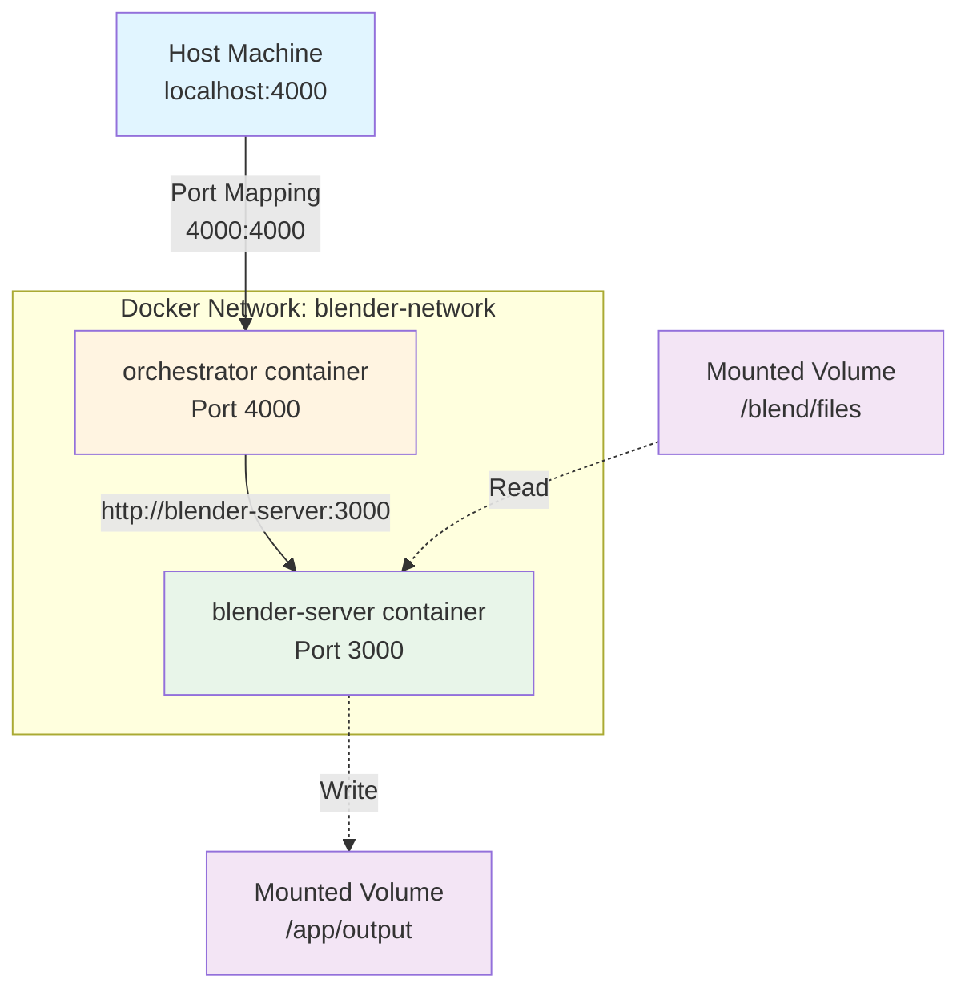

# Part 3: Dockerizing the Blender Server and Orchestrator

In this section, we'll containerize both the Blender server and orchestrator using Docker. This ensures consistent, portable, and isolated deployments across different environments.

<div class="learning-objectives">
<strong>🎯 Learning Objectives</strong>
<ul>
<li>Understand the benefits of containerization</li>
<li>Create Dockerfiles for Node.js applications</li>
<li>Use Docker networks for inter-container communication</li>
<li>Mount volumes for persistent data</li>
<li>Build and run Docker containers</li>
<li>Understand container resource limitations</li>
</ul>
</div>

## Why Docker?

Docker provides a way to package and run applications in isolated environments called **containers**. This approach offers several benefits:

- **Consistency**: Applications run the same way in any environment (dev, staging, production)
- **Portability**: Containers can be easily shared and deployed across different systems
- **Isolation**: Applications and dependencies are separated from the host system
- **Scalability**: Simplifies scaling by running multiple container instances
- **Reproducibility**: Dockerfile serves as documentation for the exact environment

## Limitations and Considerations

### Image Size
Blender is a large application (~500MB+), so the Docker image will be substantial in size. Consider:
- Using `.dockerignore` to exclude unnecessary files
- Multi-stage builds for production deployments
- Image layer optimization

### Resource Management
Running Blender inside a container requires careful tuning:
- **CPU**: Docker has configurable CPU limits ([Docker CPU Constraints](https://docs.docker.com/config/containers/resource_constraints/#cpu))
- **GPU**: GPU access requires NVIDIA Container Toolkit ([NVIDIA Docker](https://docs.nvidia.com/datacenter/cloud-native/container-toolkit/overview.html))
- **Memory**: Set appropriate memory limits to prevent OOM errors

### Storage
Ensure Blender files and output directories are properly mounted to access them outside the container.

> **Note:** For this tutorial, Docker is used to demonstrate containerization basics. Production deployments would require additional optimization for Blender's resource-intensive workloads.

## Step 1: Installing Docker

Install Docker for your operating system:

- 🪟 [Docker for Windows](https://docs.docker.com/docker-for-windows/install/)
- 🍎 [Docker for Mac](https://docs.docker.com/docker-for-mac/install/)
- 🐧 [Docker for Linux](https://docs.docker.com/engine/install/)

**Verify installation:**
```bash
docker --version
docker run hello-world
```

## Step 2: Update server.js for Docker

Update `server.js` to use paths that work inside a container:

```javascript
const port = 3000; // Port to match Dockerfile

// Paths inside the container
const blenderPath = '/usr/bin/blender';
const blendFilePath = '/app/blend/files/splash-pokedstudio.blend';
const outputDir = '/app/output';
```

**Key changes:**
- `blenderPath`: Blender location in the container
- `blendFilePath`: Mounted volume path for `.blend` files
- `outputDir`: Mounted volume path for rendered frames

## Step 3: Create Docker Network

Create a custom Docker network to enable communication between containers:

```bash
docker network create blender-network
```

This allows containers to communicate using container names as hostnames (e.g., `http://blender-server:3000`).

## Step 4: Dockerfile for the Blender Server

Create a `Dockerfile` in the `server/` directory:

```dockerfile
# Use the linuxserver/blender Docker image as the base
FROM linuxserver/blender:latest

# Install Node.js and npm
RUN apt-get update && apt-get install -y \
    nodejs \
    npm \
    && rm -rf /var/lib/apt/lists/*

# Set the working directory inside the container
WORKDIR /app

# Copy application files into the container
COPY . .

# Install Node.js dependencies
RUN npm install

# Expose the port that your API will run on
EXPOSE 3000

# Override the entrypoint to bypass starting Xvnc and Openbox
ENTRYPOINT []

# Start the Node.js application
CMD ["node", "server.js"]
```

**Dockerfile breakdown:**
- `FROM linuxserver/blender:latest`: Base image with Blender pre-installed
- `RUN apt-get install`: Install Node.js runtime
- `WORKDIR /app`: Set working directory
- `COPY . .`: Copy application code
- `RUN npm install`: Install dependencies
- `EXPOSE 3000`: Document the port (doesn't actually publish it)
- `ENTRYPOINT []`: Override base image entrypoint
- `CMD ["node", "server.js"]`: Start the application

### Building the Docker Image

```bash
cd server
docker build -t blender-server .
```

**What happens:**
1. Docker downloads the base image
2. Installs Node.js
3. Copies your code
4. Installs npm dependencies
5. Creates a runnable image tagged `blender-server`

### Running the Container

```bash
docker run -p 3000:3000 \
  --network blender-network \
  --name blender-server \
  -v /path/to/blend/files:/app/blend/files \
  -v /path/to/output:/app/output \
  blender-server
```

**Command breakdown:**
- `-p 3000:3000`: Map host port 3000 to container port 3000
- `--network blender-network`: Connect to custom network
- `--name blender-server`: Name the container
- `-v /path/to/blend/files:/app/blend/files`: Mount blend files directory
- `-v /path/to/output:/app/output`: Mount output directory

> **Note:** Replace `/path/to/blend/files` and `/path/to/output` with actual paths on your host system. Paths should end with `/` for directories.

## Step 5: Update orchestrator.js for Docker

Update `orchestrator.js` to use container names instead of localhost:

```javascript
const NODES = [
    'http://blender-server:3000', // Use container name as hostname
];
```

When containers are on the same Docker network, they can communicate using container names thanks to Docker's built-in DNS.

## Step 6: Dockerfile for the Orchestrator

Create a `Dockerfile` in the `orchestrator/` directory:

```dockerfile
# Use the official Node.js image as the base
FROM node:16

# Set the working directory inside the container
WORKDIR /app

# Copy application files into the container
COPY . .

# Install Node.js dependencies
RUN npm install

# Expose the port that your API will run on
EXPOSE 4000

# Start the Node.js application
CMD ["node", "orchestrator.js"]
```

**Why node:16?** Unlike the server, the orchestrator doesn't need Blender, so we use a lightweight Node.js base image.

### Building the Docker Image

```bash
cd orchestrator
docker build -t orchestrator .
```

### Running the Container

```bash
docker run -p 4000:4000 \
  --network blender-network \
  --name orchestrator \
  orchestrator
```

## Testing the Dockerized System

### 1. Start the Blender Server

```bash
docker run -d -p 3000:3000 \
  --network blender-network \
  --name blender-server \
  -v /path/to/blend/files:/app/blend/files \
  -v /path/to/output:/app/output \
  blender-server
```

**The `-d` flag runs the container in detached mode (background).**

### 2. Start the Orchestrator

```bash
docker run -d -p 4000:4000 \
  --network blender-network \
  --name orchestrator \
  orchestrator
```

### 3. Submit a Render Job

```bash
curl -X POST http://localhost:4000/render \
  -H "Content-Type: application/json" \
  -d '{"from": 1, "to": 20}' \
  -i
```

Same `curl` command as before - but now it's running in containers!

### 4. View Container Logs

```bash
# Orchestrator logs
docker logs orchestrator

# Blender server logs
docker logs blender-server
```

### 5. Stop and Remove Containers

```bash
docker stop orchestrator blender-server
docker rm orchestrator blender-server
```

## Docker Networking Diagram



## Troubleshooting

### Container won't start
```bash
docker logs <container-name>
```

### Can't connect between containers
```bash
# Verify both containers are on the same network
docker network inspect blender-network
```

### Volume mount issues
Ensure:
- Paths are absolute (not relative)
- Directories exist on the host
- You have proper permissions

### Port already in use
```bash
# Find what's using the port
lsof -i :3000

# Or use different ports
docker run -p 3001:3000 ...
```

## Conclusion

You've successfully containerized your distributed rendering system! Your setup now has:
- ✅ Dockerized Blender server
- ✅ Dockerized orchestrator
- ✅ Docker network for inter-container communication
- ✅ Volume mounts for persistent data
- ✅ Consistent deployment across environments

### Next Steps

In the next section, we'll use **Docker Compose** to manage multiple containers with a single configuration file, making deployment even simpler.

---

<div class="nav-links">
  <a href="02-orchestrator.html">← Part 2: Orchestrator</a>
  <a href="04-docker-compose.html">Part 4: Docker Compose →</a>
</div>

---

**💡 See the complete code:** [examples/part3-docker](../examples/part3-docker)

**Having issues?** [Open an issue on GitHub](https://github.com/khnumdev/dist-app-tutorial/issues)
