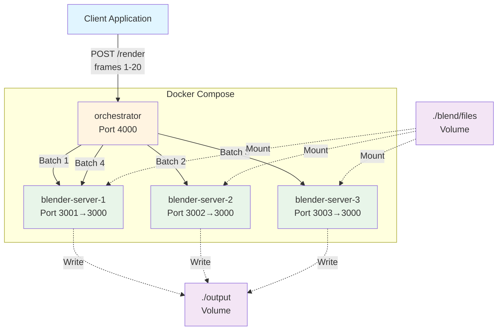

# Part 4: Using Docker Compose for Deployment

In this section, we'll use Docker Compose to manage and deploy multiple containers with a single configuration file. This simplifies orchestration of our distributed rendering system.

<div class="learning-objectives">
<strong>🎯 Learning Objectives</strong>
<ul>
<li>Understand the benefits of Docker Compose</li>
<li>Define multi-container applications in YAML</li>
<li>Configure service dependencies</li>
<li>Scale services to multiple instances</li>
<li>Manage networks and volumes declaratively</li>
<li>Deploy the entire system with one command</li>
</ul>
</div>

## Why Docker Compose?

Docker Compose simplifies the management of multi-container Docker applications. Instead of running multiple `docker run` commands, you define everything in a single `docker-compose.yml` file.

**Benefits:**
- **Single Configuration**: Define all services, networks, and volumes in one place
- **Simplified Commands**: Start/stop entire system with one command
- **Dependency Management**: Automatically start services in the correct order
- **Environment Consistency**: Same configuration across dev, staging, and production
- **Easy Scaling**: Scale services up or down with simple commands
- **Version Control**: Track infrastructure changes in git

## Architecture with Docker Compose



## Step 1: Create docker-compose.yml

Create a `docker-compose.yml` file in your project root directory:

```yaml
version: '3.8'

services:
  blender-server-1:
    build:
      context: ./server
    ports:
      - "3001:3000"
    volumes:
      - ./blend/files:/app/blend/files
      - ./output:/app/output
    networks:
      - blender-network

  blender-server-2:
    build:
      context: ./server
    ports:
      - "3002:3000"
    volumes:
      - ./blend/files:/app/blend/files
      - ./output:/app/output
    networks:
      - blender-network

  blender-server-3:
    build:
      context: ./server
    ports:
      - "3003:3000"
    volumes:
      - ./blend/files:/app/blend/files
      - ./output:/app/output
    networks:
      - blender-network

  orchestrator:
    build:
      context: ./orchestrator
    ports:
      - "4000:4000"
    depends_on:
      - blender-server-1
      - blender-server-2
      - blender-server-3
    networks:
      - blender-network

networks:
  blender-network:
    driver: bridge
```

**Configuration breakdown:**

### Services Section
- **blender-server-1, 2, 3**: Three identical Blender server instances
  - `build.context`: Path to Dockerfile directory
  - `ports`: Map host ports 3001-3003 to container port 3000
  - `volumes`: Mount blend files (read) and output directory (write)
  - `networks`: Connect to custom network

- **orchestrator**: Orchestrator service
  - `depends_on`: Wait for servers to start before starting orchestrator
  - `ports`: Expose port 4000 to host

### Networks Section
- **blender-network**: Custom bridge network for inter-container communication

## Step 2: Project Directory Structure

Ensure your project directory is structured as follows:

```
distributed-system-tutorial/
│
├── server/
│   ├── Dockerfile
│   ├── server.js
│   ├── package.json
│   └── node_modules/
│
├── orchestrator/
│   ├── Dockerfile
│   ├── orchestrator.js
│   ├── package.json
│   └── node_modules/
│
├── blend/
│   └── files/
│       └── splash-pokedstudio.blend
│
├── output/
│   └── (rendered frames will appear here)
│
└── docker-compose.yml
```

## Step 3: Update Orchestrator for Three Servers

Update the `NODES` array in `orchestrator.js` to reference all three servers:

```javascript
const NODES = [
    'http://blender-server-1:3000', // First server
    'http://blender-server-2:3000', // Second server
    'http://blender-server-3:3000', // Third server
];
```

**How it works:**
- Docker Compose creates DNS entries for each service
- Services can communicate using service names as hostnames
- Round-robin distribution will cycle through all three servers

## Step 4: Build and Run with Docker Compose

### Start the Entire System

```bash
docker-compose up --build
```

**What happens:**
1. Builds images for `server` and `orchestrator` (if not cached)
2. Creates the `blender-network` network
3. Starts `blender-server-1`, `blender-server-2`, `blender-server-3`
4. Waits for servers to be ready
5. Starts `orchestrator`
6. Attaches to logs (you'll see output from all containers)

### Run in Detached Mode

To run in the background:

```bash
docker-compose up -d --build
```

### View Logs

```bash
# All services
docker-compose logs

# Follow logs in real-time
docker-compose logs -f

# Specific service
docker-compose logs orchestrator
docker-compose logs blender-server-1
```

### Check Status

```bash
docker-compose ps
```

Expected output:
```
NAME                          COMMAND                  STATUS    PORTS
orchestrator                  "node orchestrator.js"   Up        0.0.0.0:4000->4000/tcp
blender-server-1              "node server.js"         Up        0.0.0.0:3001->3000/tcp
blender-server-2              "node server.js"         Up        0.0.0.0:3002->3000/tcp
blender-server-3              "node server.js"         Up        0.0.0.0:3003->3000/tcp
```

## Step 5: Test the System

### Submit a Render Job

```bash
curl -X POST http://localhost:4000/render \
  -H "Content-Type: application/json" \
  -d '{"from": 1, "to": 20}' \
  -i
```

**Expected response:**
```
HTTP/1.1 202 Accepted
Location: /status/abc123

{"jobId":"abc123"}
```

### Check Job Status

```bash
curl -X GET http://localhost:4000/status/abc123 -i
```

### Watch the Distribution

In the Docker Compose logs, you should see:
- **Orchestrator**: Splitting frames and distributing batches
- **blender-server-1**: Processing frames 1-5, 16-20
- **blender-server-2**: Processing frames 6-10
- **blender-server-3**: Processing frames 11-15

This demonstrates **parallel processing** across three nodes!

## Managing the System

### Stop All Services

```bash
docker-compose down
```

This stops and removes containers and networks.

### Stop Without Removing

```bash
docker-compose stop
```

Resume with:
```bash
docker-compose start
```

### Rebuild After Code Changes

```bash
docker-compose up --build
```

### Scale a Service

While our configuration has 3 fixed servers, you can scale services:

```bash
docker-compose up --scale blender-server-1=5
```

(You'd need to remove the port mapping to avoid conflicts)

### Remove Everything Including Volumes

```bash
docker-compose down -v
```

**Warning:** This deletes volume data!

## Docker Compose Commands Cheatsheet

| Command | Description |
|---------|-------------|
| `docker-compose up` | Start all services |
| `docker-compose up -d` | Start in detached mode |
| `docker-compose up --build` | Rebuild images before starting |
| `docker-compose down` | Stop and remove containers |
| `docker-compose ps` | List running services |
| `docker-compose logs` | View logs |
| `docker-compose logs -f` | Follow logs |
| `docker-compose exec <service> <cmd>` | Run command in service |
| `docker-compose restart` | Restart all services |
| `docker-compose stop` | Stop services (keep containers) |
| `docker-compose start` | Start stopped services |

## Troubleshooting

### Port Already in Use

```bash
# Find what's using the port
lsof -i :3001

# Change port in docker-compose.yml
ports:
  - "3101:3000"  # Use 3101 instead
```

### Services Can't Communicate

```bash
# Verify network
docker network inspect distributed-system-tutorial_blender-network

# Check service names
docker-compose ps
```

### Volumes Not Mounting

Ensure paths in `docker-compose.yml` are relative to the docker-compose.yml file location, or use absolute paths.

### Build Cache Issues

```bash
# Force rebuild without cache
docker-compose build --no-cache
docker-compose up
```

## Conclusion

You've deployed a complete distributed rendering system with Docker Compose! Your setup includes:
- ✅ Three Blender rendering servers
- ✅ One orchestrator managing workload distribution
- ✅ Custom Docker network for inter-service communication
- ✅ Mounted volumes for blend files and output
- ✅ Single-command deployment and management

**Performance**: With three servers, you can render frames **~3x faster** through parallel processing!

### Next Steps

In the next section, we'll explore **enhancements and production considerations** including rate limiting, service discovery, Kubernetes deployment, and more.

---

<div class="nav-links">
  <a href="03-docker.md">← Part 3: Docker</a>
  <a href="05-enhancements.md">Part 5: Enhancements →</a>
</div>

---

**💡 See the complete code:** [examples/part4-docker-compose](../examples/part4-docker-compose)

**Having issues?** [Open an issue on GitHub](https://github.com/khnumdev/dist-app-tutorial/issues)
