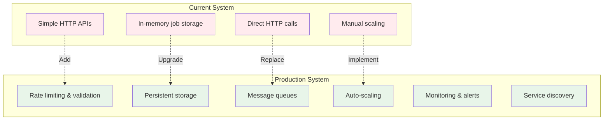
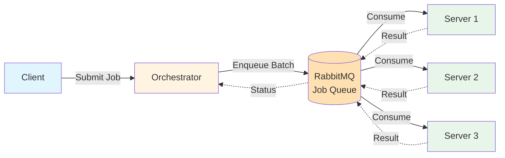

# Enhancements and Future Improvements

In this section, we'll explore potential enhancements to make the distributed rendering system production-ready. These improvements focus on performance, scalability, reliability, and operational excellence.

<div class="learning-objectives">
<strong>🎯 What You'll Learn</strong>
<ul>
<li>Implement rate limiting and queue management</li>
<li>Add service discovery for dynamic scaling</li>
<li>Use message queues for decoupling</li>
<li>Deploy to production (Kubernetes/AKS)</li>
<li>Implement monitoring and logging</li>
<li>Enhance security and fault tolerance</li>
</ul>
</div>

## Overview

While the current implementation works for learning purposes, production deployments require additional considerations:



## 1. Rate Limiting (429 Too Many Requests)

Prevent server overload by limiting the number of requests.

### Implementation with express-rate-limit

```javascript
const rateLimit = require('express-rate-limit');

// Configure rate limiter
const limiter = rateLimit({
    windowMs: 15 * 60 * 1000, // 15 minutes
    max: 100, // Limit each IP to 100 requests per windowMs
    message: 'Too many requests, please try again later.',
    standardHeaders: true, // Return rate limit info in headers
    legacyHeaders: false,
});

// Apply to all routes
app.use('/job', limiter);
```

### Response Headers

When rate limited, clients receive:
```
HTTP/1.1 429 Too Many Requests
X-RateLimit-Limit: 100
X-RateLimit-Remaining: 0
X-RateLimit-Reset: 1634567890
Retry-After: 60

Too many requests, please try again later.
```

📚 [RFC 6585 - Additional HTTP Status Codes](https://tools.ietf.org/html/rfc6585)

## 2. Single Job Processing Per Server

Ensure each server processes only one job at a time to prevent resource exhaustion.

### Server Implementation

```javascript
let currentJob = null;

app.post('/job', (req, res) => {
    // Check if server is busy
    if (currentJob !== null) {
        return res.status(503)
            .header('Retry-After', 30)
            .send('Server busy, try again later');
    }
    
    const { from, to } = req.body;
    const jobProcess = exec(blenderCommand);
    
    currentJob = {
        pid: jobProcess.pid,
        process: jobProcess
    };
    
    jobProcess.on('close', () => {
        currentJob = null; // Mark server as available
    });
    
    res.status(202)
        .header('Location', `/job/${jobProcess.pid}`)
        .send({ pid: jobProcess.pid });
});
```

### Orchestrator Job Queue

```javascript
const queue = [];
let processing = false;

async function processQueue() {
    if (processing || queue.length === 0) return;
    
    processing = true;
    const job = queue.shift();
    
    try {
        await distributeJob(job);
    } catch (error) {
        // Retry logic
        if (error.response?.status === 503) {
            queue.push(job); // Re-queue
        }
    }
    
    processing = false;
    processQueue(); // Process next job
}

app.post('/render', (req, res) => {
    const job = { from: req.body.from, to: req.body.to };
    queue.push(job);
    processQueue();
    res.status(202).send({ status: 'queued' });
});
```

## 3. Production Deployment (Kubernetes/AKS)

Deploy to Azure Kubernetes Service for production-grade infrastructure.

### AKS Architecture

```mermaid
graph TB
    subgraph "Azure Kubernetes Service"
        subgraph "Ingress"
            Ingress[Ingress Controller<br/>Load Balancer]
        end
        
        subgraph "Orchestrator Pods"
            Orch1[orchestrator-1]
            Orch2[orchestrator-2]
        end
        
        subgraph "Blender Server Pods"
            Server1[blender-server-1]
            Server2[blender-server-2]
            Server3[blender-server-3]
            ServerN[blender-server-n]
        end
        
        subgraph "Storage"
            PV[Persistent Volume<br/>Azure Files]
        end
    end
    
    Client[Client] -->|HTTPS| Ingress
    Ingress --> Orch1
    Ingress --> Orch2
    
    Orch1 --> Server1
    Orch1 --> Server2
    Orch2 --> Server3
    Orch2 --> ServerN
    
    Server1 -.-> PV
    Server2 -.-> PV
    Server3 -.-> PV
    ServerN -.-> PV
    
    style Client fill:#e1f5ff
    style Ingress fill:#fff4e1
    style Orch1 fill:#fff4e1
    style Orch2 fill:#fff4e1
    style Server1 fill:#e8f5e9
    style Server2 fill:#e8f5e9
    style Server3 fill:#e8f5e9
    style ServerN fill:#e8f5e9
    style PV fill:#f3e5f5
```

### Kubernetes Deployment Manifest

```yaml
apiVersion: apps/v1
kind: Deployment
metadata:
  name: blender-server
spec:
  replicas: 3
  selector:
    matchLabels:
      app: blender-server
  template:
    metadata:
      labels:
        app: blender-server
    spec:
      containers:
      - name: blender-server
        image: yourregistry.azurecr.io/blender-server:latest
        resources:
          requests:
            memory: "2Gi"
            cpu: "1000m"
          limits:
            memory: "4Gi"
            cpu: "2000m"
        ports:
        - containerPort: 3000
---
apiVersion: v1
kind: Service
metadata:
  name: blender-server
spec:
  selector:
    app: blender-server
  ports:
  - port: 3000
    targetPort: 3000
```

### Key Features

**Cluster Autoscaler**: Automatically scale nodes based on demand
```bash
az aks update \
  --resource-group myResourceGroup \
  --name myAKSCluster \
  --enable-cluster-autoscaler \
  --min-count 1 \
  --max-count 10
```

**Horizontal Pod Autoscaler**: Scale pods based on CPU/memory
```yaml
apiVersion: autoscaling/v2
kind: HorizontalPodAutoscaler
metadata:
  name: blender-server-hpa
spec:
  scaleTargetRef:
    apiVersion: apps/v1
    kind: Deployment
    name: blender-server
  minReplicas: 3
  maxReplicas: 10
  metrics:
  - type: Resource
    resource:
      name: cpu
      target:
        type: Utilization
        averageUtilization: 70
```

📚 [Azure Kubernetes Service Documentation](https://learn.microsoft.com/en-us/azure/aks/)

## 4. Service Discovery

Automatically detect available rendering nodes.

### Kubernetes Service Discovery

Kubernetes provides built-in service discovery through DNS:

```javascript
// Orchestrator code
const NODES = process.env.BLENDER_SERVICE_URL || 'http://blender-server:3000';

// Kubernetes creates DNS entries automatically
// Service name 'blender-server' resolves to all pod IPs
```

### Using Consul (Alternative)

```javascript
const consul = require('consul')();

// Register service
await consul.agent.service.register({
    name: 'blender-server',
    address: 'localhost',
    port: 3000,
    check: {
        http: 'http://localhost:3000/health',
        interval: '10s'
    }
});

// Discover services
const services = await consul.health.service('blender-server');
const NODES = services.map(s => `http://${s.Service.Address}:${s.Service.Port}`);
```

📚 [Kubernetes Service Discovery](https://kubernetes.io/docs/concepts/services-networking/service/#discovering-services)

## 5. Message Queues

Decouple orchestrator and servers for better reliability.

### Architecture with RabbitMQ



### Orchestrator with RabbitMQ

```javascript
const amqp = require('amqplib');

// Connect to RabbitMQ
const connection = await amqp.connect('amqp://localhost');
const channel = await connection.createChannel();
await channel.assertQueue('render-jobs', { durable: true });

// Enqueue job
app.post('/render', async (req, res) => {
    const job = { from: req.body.from, to: req.body.to };
    const batches = splitFramesIntoChunks(job.from, job.to, BATCH_SIZE);
    
    for (const batch of batches) {
        channel.sendToQueue('render-jobs', 
            Buffer.from(JSON.stringify(batch)),
            { persistent: true }
        );
    }
    
    res.status(202).send({ status: 'queued' });
});
```

### Server as Queue Consumer

```javascript
const amqp = require('amqplib');

const connection = await amqp.connect('amqp://localhost');
const channel = await connection.createChannel();
await channel.assertQueue('render-jobs', { durable: true });

// Consume one job at a time
channel.prefetch(1);

channel.consume('render-jobs', async (msg) => {
    const job = JSON.parse(msg.content.toString());
    
    try {
        await renderFrames(job.from, job.to);
        channel.ack(msg); // Mark as processed
    } catch (error) {
        channel.nack(msg, false, true); // Requeue on failure
    }
}, { noAck: false });
```

**Benefits:**
- Automatic retry on failure
- Load balancing across servers
- Persistence (jobs survive crashes)
- Backpressure handling

📚 [RabbitMQ Tutorials](https://www.rabbitmq.com/getstarted.html)

## 6. Monitoring and Logging

Implement comprehensive observability.

### Structured Logging

```javascript
const winston = require('winston');

const logger = winston.createLogger({
    format: winston.format.combine(
        winston.format.timestamp(),
        winston.format.json()
    ),
    transports: [
        new winston.transports.Console(),
        new winston.transports.File({ filename: 'app.log' })
    ]
});

// Usage
logger.info('Job started', { 
    jobId: '123', 
    frames: { from: 1, to: 5 },
    node: 'server-1'
});
```

### Distributed Tracing

```javascript
const opentelemetry = require('@opentelemetry/api');
const tracer = opentelemetry.trace.getTracer('blender-app');

app.post('/render', async (req, res) => {
    const span = tracer.startSpan('render-job');
    
    try {
        await distributeJob(req.body);
        span.setStatus({ code: opentelemetry.SpanStatusCode.OK });
    } catch (error) {
        span.setStatus({ 
            code: opentelemetry.SpanStatusCode.ERROR,
            message: error.message 
        });
    } finally {
        span.end();
    }
});
```

### Prometheus Metrics

```javascript
const prometheus = require('prom-client');

const jobsTotal = new prometheus.Counter({
    name: 'jobs_total',
    help: 'Total number of render jobs',
    labelNames: ['status']
});

const jobDuration = new prometheus.Histogram({
    name: 'job_duration_seconds',
    help: 'Job duration in seconds',
    buckets: [1, 5, 15, 30, 60, 120]
});

// Track metrics
jobsTotal.inc({ status: 'started' });
const timer = jobDuration.startTimer();
// ... process job ...
timer();
```

📚 [ELK Stack](https://www.elastic.co/what-is/elk-stack) | [Azure Monitor](https://docs.microsoft.com/en-us/azure/azure-monitor/)

## 7. Additional Improvements

### Load Balancing
Distribute requests evenly across server instances.

**Kubernetes Service** provides automatic load balancing:
```yaml
apiVersion: v1
kind: Service
metadata:
  name: blender-server
spec:
  type: LoadBalancer
  selector:
    app: blender-server
  ports:
  - port: 3000
```

### Fault Tolerance
Handle failures gracefully with retry logic and circuit breakers.

```javascript
const CircuitBreaker = require('opossum');

const breaker = new CircuitBreaker(assignJobToNode, {
    timeout: 30000, // 30 seconds
    errorThresholdPercentage: 50,
    resetTimeout: 60000 // 1 minute
});

breaker.fallback(() => ({ error: 'Service temporarily unavailable' }));
```

### Security Enhancements
- **Authentication**: Add API keys or OAuth
- **Network Policies**: Restrict pod-to-pod communication
- **RBAC**: Role-based access control in Kubernetes
- **Secret Management**: Use Azure Key Vault or Kubernetes Secrets
- **TLS/HTTPS**: Encrypt all communications

### Performance Optimization
- **Connection Pooling**: Reuse HTTP connections
- **Caching**: Cache blend files in memory
- **Resource Limits**: Fine-tune CPU/memory allocation
- **Profiling**: Use Node.js profiler to identify bottlenecks

## Conclusion

This tutorial has taken you from a simple rendering node to a production-ready distributed system. You've learned:

- ✅ Building RESTful APIs with Node.js
- ✅ Managing background processes
- ✅ Orchestrating distributed workloads
- ✅ Containerization with Docker
- ✅ Multi-container deployment with Docker Compose
- ✅ Production deployment strategies
- ✅ Monitoring and observability
- ✅ Scalability and fault tolerance

### Next Steps

- Implement rate limiting in your servers
- Set up a message queue (RabbitMQ or Azure Service Bus)
- Deploy to a Kubernetes cluster
- Add monitoring with Prometheus and Grafana
- Implement distributed tracing
- Contribute improvements back to this tutorial!

---

<div class="nav-links">
  <a href="04-docker-compose.html">← Part 4: Docker Compose</a>
  <a href="index.html">Back to Overview</a>
</div>

---

**🎉 Congratulations!** You've completed the distributed systems tutorial!

**Want to contribute?** See our [Contributing Guide](https://github.com/khnumdev/dist-app-tutorial/blob/main/CONTRIBUTING.md)

**Having issues?** [Open an issue on GitHub](https://github.com/khnumdev/dist-app-tutorial/issues)
