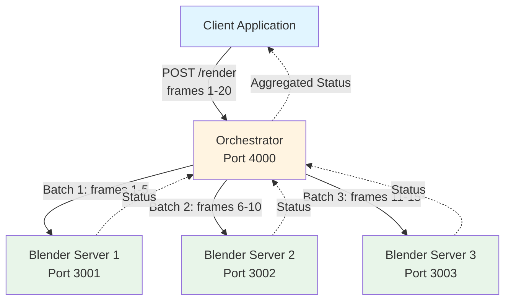

# How to Build Your First Distributed System

> **Note:** This is a tutorial to start building an example of a distributed system and is not intended for a production deployment.

<strong>🎯 What You'll Learn</strong>
<ul>
<li>Build a RESTful API with Node.js and Express</li>
<li>Manage long-running background processes</li>
<li>Orchestrate distributed workloads across multiple nodes</li>
<li>Containerize applications with Docker</li>
<li>Deploy multi-container applications with Docker Compose</li>
<li>Understand distributed systems concepts like polling, batching, and orchestration</li>
</ul>

## Overview

In this hands-on tutorial, we'll build a **distributed Blender rendering system** from scratch. You'll learn how to split a rendering workload across multiple nodes, manage concurrent jobs, and deploy the system using Docker.

By the end of this tutorial, you'll have:
- A **rendering node** that accepts Blender jobs via HTTP API
- An **orchestrator** that distributes work across multiple nodes
- A **fully containerized** deployment using Docker Compose
- Understanding of key distributed systems patterns

## Tutorial Structure

### [0. Setting Up the Environment](00-setup.md)
Install prerequisites and prepare your development environment.

### [1. Part 1: Rendering Node](01-rendering-node.md)
Create a web API that accepts Blender rendering jobs and manages background processes.

**You'll build:**
- Express.js server with RESTful endpoints
- Job submission and status checking
- Process management for Blender renders

### [2. Part 2: Orchestrator](02-orchestrator.md)
Build an orchestrator that distributes rendering workloads across multiple nodes.

**You'll learn:**
- Work distribution and batching
- Parallel job execution with Promise.all()
- Aggregating status from multiple nodes

### [3. Part 3: Docker](03-docker.md)
Containerize the rendering node and orchestrator for consistent deployment.

**You'll create:**
- Dockerfiles for server and orchestrator
- Docker networks for inter-container communication
- Container deployment strategies

### [4. Part 4: Docker Compose](04-docker-compose.md)
Deploy the entire distributed system with a single command.

**You'll configure:**
- Multi-container orchestration
- Service scaling (3 rendering nodes)
- Network isolation and service discovery

### [5. Enhancements and Future Improvements](05-enhancements.md)
Explore production-ready improvements and advanced patterns.

**Topics include:**
- Rate limiting and queue management
- Service discovery
- Production deployment strategies (Kubernetes)
- Monitoring and logging

## Architecture Overview

## Prerequisites

- **Node.js** (v14 or higher)
- **Blender** (accessible via command line)
- **Docker** (for Parts 3 and 4)
- Basic knowledge of JavaScript and REST APIs

## Getting Started

Ready to begin? Start with [Setting Up the Environment →](00-setup.md)

---

  <a href="00-setup.md">Start Tutorial →</a>

---

**Having issues?** [Open an issue on GitHub](https://github.com/khnumdev/dist-app-tutorial/issues)
